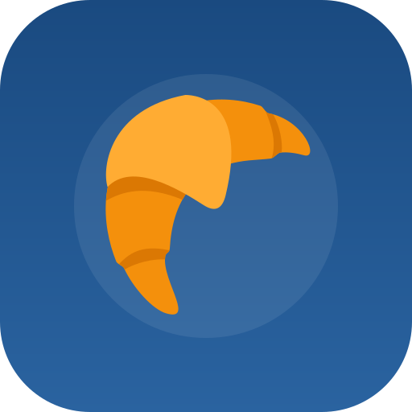

<p align="center">
  
</p>

<h1 align="center">Le Petit Atelier Français 🇫🇷</h1>

<p align="center">
  <em>français, mais amusant — a playful, Markdown-powered French learning atelier</em>
</p>

<p align="center">
  <a href="https://alinikkhah2001.github.io/French/"><strong>✦ Live Demo → alinikkhah2001.github.io/French</strong></a><br/>
  <sub>14 lessons · PWA · offline · iOS Home Screen ready</sub>
</p>

<p align="center">
  
  
  
  
  
</p>

---

A content-driven French learning platform for podcasts, books, articles, videos and custom lessons. Write lessons in Markdown, push to `main` — GitHub Actions builds the manifest, analytics and deploys to GitHub Pages. No framework, no database, no tracking — progress lives in your browser.

> This README covers what the app does, what it looks like, and how to use it — as a **learner** and as an **author**.

## ✨ Features

### 📖 Lessons as interactive ateliers
- **French ↔ English transcript cards** — reveal line by line, search, `Reveal all / Hide all`
- **Source links + embedded audio** (`audio_url` → `<audio>`, `audio_embed` → iframe)
- **Vocabulary market** — searchable, filterable by type, `Learn` + `+ List` to personal word list
- **Collocations** — chunks like *un bout de papier*, *croire en la vérité*
- **Grammar lab** — foldable cards, *Mark learned* per pattern
- **Important notes** — liaison, pronunciation, culture
- **Flashcards** (`Front → Back`) with `I knew it ✓` tracking + 🔊 pronounce
- **Exam practice** — A/B/C/D, instant scoring + explanations
- **Content filters** — podcast / book / article / video / guide + search
- **Progress per lesson** — transcript + vocab + grammar + flashcards + exam = `0–100%`

### 🗒️ My Word List — your personal carnet
Add any word from a lesson (`+ List` in Vocabulary/Flashcards) or type it yourself.

- Fields: *French — English — Type (noun/verb/expression)*
- **Bulk import** — paste lines like `chat — cat — noun`
- **Export / Import JSON** — backup or move devices
- Status pills: `New` · `Due now` · `Soon` · `Mastered` (spaced repetition)
- Every row has 🔊 **pronounce** and 📖 **dictionary**

### 🎯 Review — spaced repetition
SM-2 scheduler (Forgot / Hard / Good / Easy). Intervals grow from 1 min → 1 day → 3 days → …

- Filters: `Due now` · `New` · `Soon` · `Mastered` · `All`
- Reveal meaning, speak aloud, grade yourself — card reschedules automatically
- Activity `review` is counted in the 365-day calendar

### 📖 Dictionary + 🔊 Pronunciation
- **Dictionary popover** on any `word-link` — Wiktionary (`fr.wiktionary.org`) definitions, part of speech, IPA, with fallback
- **Speak** button everywhere — Web Speech API `fr-FR` (picks French voice if available) at `0.9×` speed
- **Links** in popover: 🔊 Pronounce · **Youglish** (real sentence video for French) · **Forvo** (native audio) · Wiktionary page

### 📊 Dashboard — Le tableau de bord
- **Current / Longest streak** 🔥
- **365-day activity grid** (GitHub-style, 4 levels)
- **Topic mastery** — transcript / vocab / grammar / flashcards / exam %
- **Corpus snapshot** — tokens, unique words, lines, lessons
- **EDA** — top transcript words, word-length distribution, learned-word breakdown
- **Frequency benchmark** — your coverage vs catalogue coverage across Top 5 000 (from OpenSubtitles 2018 via hermitdave/FrequencyWords, CC BY-SA 4.0) + *Next high-frequency words* to learn
- **Entity inventory** — searchable across lessons / vocabulary / grammar / collocations (200 shown)
- **Export / Import progress** (`schemaVersion: 2` includes word list)

### 📲 PWA — feels like a real app on iPhone
- `manifest.webmanifest` (`/French/`, `standalone`, `id: /French/`) with shortcuts (Words, Review)
- `sw.js` at root scope (`/French/sw.js` + `/French/assets/sw.js`) — precaches shell, network-first for navigation → fallback to `index.html` (fixes iOS 404), cache-first for `assets/content/data`
- **iPhone Home Screen**: `apple-touch-icon`, `apple-mobile-web-app-capable`, `status-bar-style: default`, `viewport-fit=cover`
- **Standalone minimal chrome** (`html.is-standalone`): 1px tricolor hairline, 44px top bar + `env(safe-area-inset-*)`, no shadows/rotations, flat cards, bottom tab bar (Lessons / Words / Review / Progress) with blur + 0.5px hairline — looks native, not a webpage
- **Offline** — shell + visited lessons cached; install prompt (`beforeinstallprompt`) with “📲 Install app” button (Chrome/Android)
- **Responsive + accessible** — 1100px / 980px / 760px breakpoints, `prefers-reduced-motion`, keyboard focus, `hidden !important` fix for loading states

---

## 🎨 UI — what it looks like

The design nods to French editorial + iOS minimal: cream paper, navy/blue, coral, yellow poster, Georgia headings, Inter/system body, 0.5px hairlines in app mode.

| Lesson — Transcript lab | Word list — Mon carnet |
|---|---|
| 🔊 line + Reveal English<br/>Progress `0/35 revealed` | `+ Add word` form + Bulk import<br/>Status: Due / Soon / Mastered |

| Review — Révision | Dashboard — Le tableau de bord |
|---|---|
| Spaced card: *french → english*<br/>Forgot / Hard / Good / Easy | Streak · vocab/grammar · 365 grid · frequency bands |

> **Screenshots:** add your captures to `docs/` and reference them here, e.g.
> ```md
> 
> 
> 
> 
> ```
> Tip on iPhone: open `https://alinikkhah2001.github.io/French/` → Share → **Add to Home Screen** → see bottom tab bar + safe-area.

**Web vs App:**
- **Browser** — tricolor 6px, sticky blurred top bar (78px), top nav pills, shadows/rotates.
- **Installed (standalone)** — 1px hairline, 44px bar, bottom tab bar, flat cards, `Install app` hidden, `-apple-system` font, no bounce (`overscroll-behavior: none`).

---

## 🚀 Quick start (learner)

**Use it right now:** https://alinikkhah2001.github.io/French/

1. Pick a lesson in the left library (search / filter by type)
2. **Listen** first (audio player), then **Transcript lab** → reveal English line by line
3. Open **Words** → `Learn` useful words + `+ List` to add to *My carnet* — tap French word for dictionary, 🔊 to hear it
4. **Flashcards** — say answer aloud → Reveal → `I knew it` / `+ List`
5. **Exam** → check score, then **My progress** → see streak/calendar

**Save your progress:** `My progress → Export progress` → JSON. On another device: `Import progress`. Includes word list (v2). No account.

**Install as app:**

- **iPhone (Safari):** open site → Share (□↑) → **Add to Home Screen** → Atelier. If you updated, **delete old icon first** (fixes cached manifest → 404). Re-add.
- **Android (Chrome):** open site → `📲 Install app` or menu → Install app → standalone with splash.

## 🛠️ Quick start (author / local dev)

No dependencies. Node ≥20 only for the build validator.

```bash
npm run build
# or
node scripts/build-content.mjs

python3 -m http.server 8000 --directory dist
# open http://localhost:8000
# for PWA test: http://localhost:8000/French/ needs base path — just test file serving; Pages uses /French/ prefix via SITE_BASE
```

### Add a lesson

1. Copy `content/_template.md` → `content/my-french-article.md`
2. Edit frontmatter (`title, slug, type: podcast/book/article/video/guide, level, emoji, description, duration, order, tags, source_url, audio_url/audio_embed`)
3. Write sections: `# Overview`, `# Transcript` (table French/English/Notes), `# Grammar` (`##` subsections), `# Vocabulary`, `# Collocations`, `# Important notes`, `# Flashcards`, `# Exam guide`, `# Exam practice`
4. Large transcript? Use `transcript_file: "my-transcript.tsv"` (TSV/CSV/JSON next to the `.md`)
5. `npm run build` — validates frontmatter, slug uniqueness, exam answers (A/B/C/D)
6. Commit & push to `main` — workflow builds manifest + analytics + Pages.

For full schema see [docs/content-format.md](docs/content-format.md) and `content/_template.md`.

### Word list tips

- From any lesson: `Words → + List` or `Flashcards → + List`
- Direct: `🗒️ Word list → + Add word` (or paste `manger — to eat — verb` lines into Bulk import)
- Review: `🎯 Review` → `Due now` is default; grade honestly for better scheduling.

---

## 📊 Analytics and build

`npm run build` writes to `dist/`:

- `dist/content/index.json` — manifest `{ version:2, lessons: […] }`
- `dist/data/analytics.json` — totals, distributions, `commonWords` (5 000 + `inCatalogue`/`corpusCount`), `frequencyBands`, `entities`
- `dist/data/analytics-summary.md` — job summary
- `dist/assets/` (copied), `dist/sw.js` (root scope), `dist/.nojekyll`, lesson `.md` files

PRs: validate + summary, no deploy. Pushes to `main`: validate + deploy.

Progress is `localStorage` only: `atelier-progress:{slug}`, `atelier-activity-v1`, `atelier-frequency-known-v1`, `atelier-wordlist-v1`. Export includes all.

## 🔊 Dictionary & pronunciation APIs (no keys)

- **Dictionary:** `https://fr.wiktionary.org/api/rest_v1/page/definitions/{word}` → parts of speech / definitions / IPA. Cache in memory. Falls back to `w/api.php?action=query&prop=extracts`. Popover also links to `youglish.com/pronounce/{word}/french` and `forvo.com/word/{word}/#fr`.
- **Speech:** `speechSynthesis` `fr-FR` `rate 0.9`, picks first `voice.lang startsWith fr` if present. Works on transcript lines, vocab, flashcards, word list, review.

No API keys, no backend — all client-side. CORS: Wiktionary via `origin=*` fallback.

---

## 📱 PWA details

- `assets/manifest.webmanifest` scoped to `/French/` (fixes iOS 404 where old `./` resolved to `assets/`), icons absolute `/French/assets/icons/...`
- `assets/sw.js` + `sw.js` at root — `CACHE_NAME: atelier-francais-v3`, precache via `new URL(url, self.location).href`, `install` → `skipWaiting`, `activate` → `clients.claim`, navigation: network-first → cached `index.html` / `./`, assets: cache-first.
- Registration in `assets/app.js:1167` as `../sw.js` with scope `../` (i.e. `/French/`), fallback to `assets/sw.js`.
- App shell: `index.html:128` bottom `nav.ios-tabbar` (hidden until `html.is-standalone`), wired to `location.hash` (`lessons`/`wordlist`/`review`/`dashboard`).

If Home Screen still shows 404 after update: **remove icon, clear Safari website data for `github.io`, re-add**.

---

## 📁 Project structure

```text
.
├── .github/workflows/deploy-pages.yml
├── assets/
│   ├── app.js              # router, render, word list + SM-2 + dictionary + TTS + PWA
│   ├── analytics-utils.js
│   ├── content-parser.js
│   ├── styles.css          # cream/paper theme + standalone minimal + bottom tabbar + safe-area
│   ├── sw.js               # also copied to /sw.js for root scope
│   ├── manifest.webmanifest
│   ├── logo.svg
│   ├── favicon*.png
│   └── icons/ icon.svg, icon-192/512/1024.png
├── content/
│   ├── _template.md
│   ├── episode-88-une-chanson-revolutionnaire.md  # A1–A2 podcast
│   ├── french-exams-roadmap.md
│   ├── confidence-au-piano.md … (12 Billy Easton video lessons A2–B1)
│   └── _sample-transcript.tsv
├── data/fr_50k.txt         # OpenSubtitles 2018 top 50k (benchmark uses first 5k)
├── docs/content-format.md
├── scripts/build-content.mjs
├── index.html              # PWA meta, topbar, library, 4 views, ios-tabbar, templates
└── package.json            # type: module, node >=20, scripts: build/test
```

## 🔊 Audio and podcast embeds

```yaml
audio_url: "https://example.com/episode.mp3"       # → <audio controls>
audio_embed: "https://player.example.com/embed/123" # → <iframe sandboxed>
source_url: "https://podcast.duolingo.com/..."       # → Open original source ↗
apple_url: "https://podcasts.apple.com/..."          # → Apple Podcasts ↗
```

Always keep a source link as fallback.

## 📝 Content schema

See [docs/content-format.md](docs/content-format.md). Known top-level `#` sections: `Overview`, `Transcript`, `Grammar` (`##` cards), `Vocabulary`, `Collocations`, `Important notes`, `Flashcards`, `Exam guide`, `Exam practice`. Others become reading notes.

---

## 🌙 Themes, a11y, performance

- Light / dark via `html[data-theme]` + `localStorage atelier-theme` + `prefers-color-scheme`
- `overscroll-behavior: none` (no bounce in app), `-webkit-tap-highlight-color: transparent`, focus ring `var(--yellow)`
- `[hidden] { display:none !important }` fix for `display:grid` override
- `prefers-reduced-motion` disables animations
- No framework — ~30 KB JS (parser + app) + CSS, instant `dist/` deploy

---

## © Copyright and attribution

Linking/embedding does not grant republication rights. Publish only your own / licensed / public-domain / fair-use excerpts, always attribute + keep source link.

Example lesson links back to [Duolingo episode](https://podcast.duolingo.com/episode-88-une-chanson-revolutionnaire-a-song-of-revolution-revisited) + [Apple Podcasts](https://podcasts.apple.com/ca/podcast/une-chanson-r%C3%A9volutionnaire-a-song-of/id1466824259?i=1000604023506).

## 📚 Official references (example content)

- [DELF tout public](https://www.france-education-international.fr/en/diplome/delf-tout-public)
- [DALF](https://www.france-education-international.fr/en/diplome/dalf)
- [TCF tout public](https://www.france-education-international.fr/en/test/tcf-tout-public)
- [TEF Canada](https://www.lefrancaisdesaffaires.fr/en/candidate/test-evaluation-francais/tef-canada/presentation/)

## 📊 Frequency data

Top 5 000 uses first 5k rows of French OpenSubtitles 2018 from [hermitdave/FrequencyWords](https://github.com/hermitdave/FrequencyWords) (`fr_50k.txt`), CC BY-SA 4.0. It’s conversational, corpus-specific — a benchmark, not a learning order. See [Lexique](https://www.lexique.org/) as pedagogical alternative. See [THIRD_PARTY_NOTICES.md](THIRD_PARTY_NOTICES.md).

---

<p align="center">
  <sub>Built with vanilla JS · Deployed on GitHub Pages · Install on iPhone → Share → Add to Home Screen · <em>petit à petit</em> 🥐</sub>
</p>
